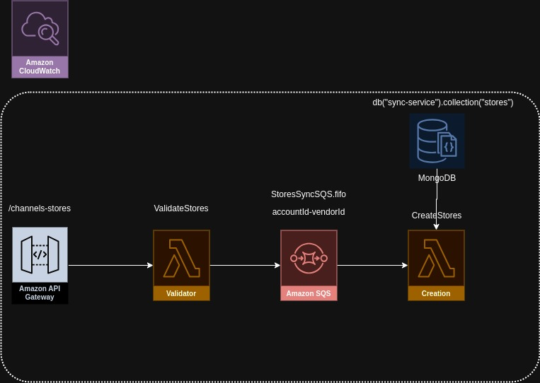
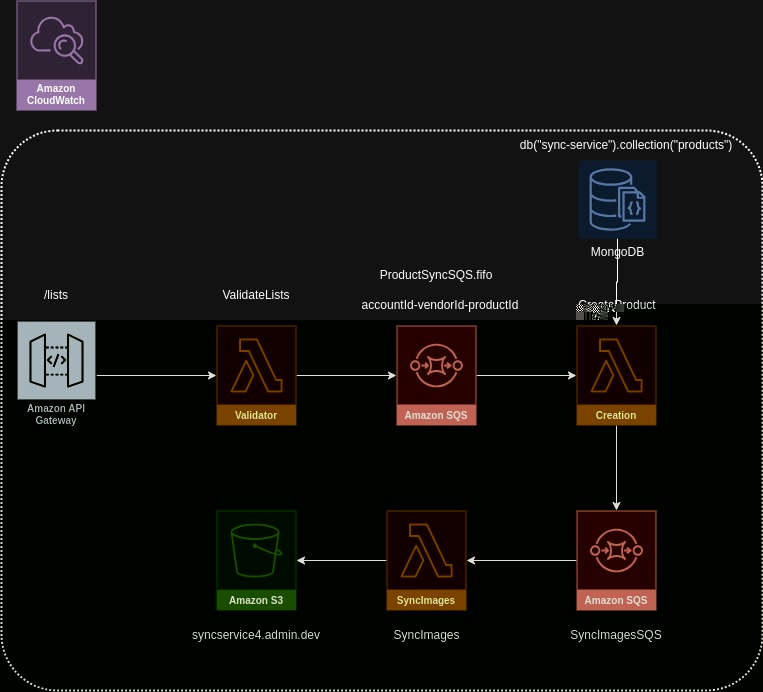
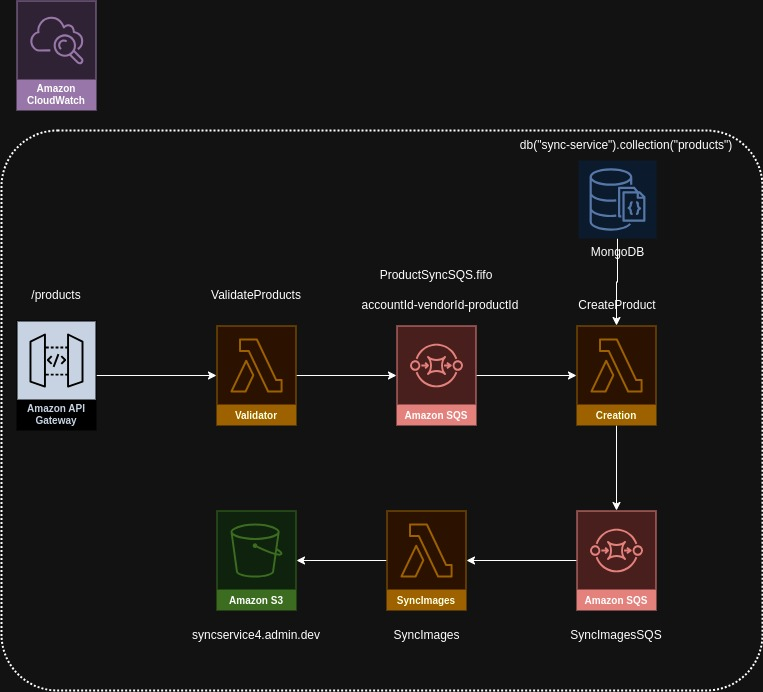

# Microservicio Sync Service

El **Sync Service** es un microservicio diseñado para simplificar la sincronización de tiendas y productos de los clientes de TRD. El objetivo es facilitar este proceso de manera eficiente y sin complicaciones. Se ha mantenido la estructura de las peticiones de sincronización anterior para garantizar la transición suave y minimizar cualquier impacto en los sistemas existentes y, sobre todo, para asegurar la comodidad y familiaridad de los clientes.

## Mejoras en la Tecnología

Se implementaron mejoras tecnológicas significativas para agilizar el proceso de sincronización. Ahora se hace uso de la base de datos MongoDB y se han reestructurado los documentos, consolidando la información necesaria en las colecciones de **stores** y **products**.

## Funcionamiento

El microservicio opera en varias fases:

1. **Envío de Solicitudes de Sincronización:**

   - Los clientes envían peticiones de sincronización, ya sea para **stores** o **products**, a los endpoints específicos. ([Ver más sobre los endpoints](#endpoints))

2. **Validación y Procesamiento de las Solicitudes:**

   - Tras la recepción de la petición, el microservicio realiza una validación exhaustiva y la envía a otro lambda para su procesamiento. ([Ver consideraciones](#consideraciones-importantes))

3. **Sincronización de Imágenes (si es requerido):**

   - En caso de que la petición incluya imágenes, estas se enfilan para ser procesadas por una función lambda separada.

4. **Almacenamiento de Datos en Estado "DRAFT":**

   - Los datos se almacenan en colecciones de la base de datos en estado de "borrador".

5. **Proceso de Publicación de la Sincronización:**
   - Una vez finalizado el proceso de sincronización, se puede invocar el endpoint de PUBLICACIÓN ([Ver más sobre este endpoint](enlace_endpoint)). Todos los objetos en estado de "borrador" se actualizan a "publicados". Además, los documentos se almacenan en un bucket S3 para su posterior sincronización en el servicio de ADMIN. ([Detalles sobre las integraciones](enlace_integraciones))

## Beneficios de la Sincronización

Esta sincronización ofrece múltiples beneficios, entre ellos:

- Posibilidad de sincronizar múltiples clientes simultáneamente.
- Reducción significativa de los tiempos de sincronización.
- Actualización selectiva únicamente de los documentos que han sufrido cambios.
- Implementación de pruebas unitarias para facilitar el desarrollo.
- Almacenamiento de logs en CloudWatch, lo que no solo reduce costos sino que también facilita la búsqueda y seguimiento de información.

## Infraestructura y Consideraciones Clave

Este proyecto está desarrollado utilizando AWS SAM (Serverless Application Model). La estructura de la infraestructura puede ser modificada en el archivo template.yml.

### Infraestructura de los Endpoints


El flujo de llamadas a los endpoints incluye la validación por un lambda que inicia el proceso de sincronización, seguido por la activación del procesamiento de la petición a través de SQS y lambdas específicos según la configuración. Se procesan las imágenes en SQS y se almacenan en un bucket S3. La información del procesamiento se guarda en la colección "images" en MongoDB.

### Endpoints

#### Tiendas

```
[POST] /channels-stores
```
Este endpoint permite registrar tiendas y canales de venta en el sistema.




#### Listas

```
[POST] /listas
```
Este endpoint permite registrar o editar una lista en el sistema.



#### Products

```
[POST] /products
```
Este endpoint permite agregar una lista en el sistema.



### Consideraciones Importantes

- **Limitaciones de AWS API Gateway:** La respuesta debe tardar como máximo 30 segundos. Se dividen endpoints para gestionar la respuesta al cliente.
- **Uso de AWS SQS:** Permite configurar la cantidad de lambdas para atender las peticiones, controlando los recursos utilizados.
- **Optimización de Recursos:** Algunos lambdas se han configurado con mayor memoria RAM para un mejor rendimiento. Todas las configuraciones están detalladas en el archivo template.yml.

-------

_Se recomienda proporcionar enlaces reales a la documentación y recursos mencionados._

Esta documentación proporciona una visión detallada y comprensible del microservicio Sync Service para usuarios que aún no están familiarizados con su funcionamiento. Ofrece explicaciones detalladas de cada paso del proceso de sincronización, resalta sus beneficios y describe la infraestructura subyacente junto con las consideraciones clave para su correcto funcionamiento.
